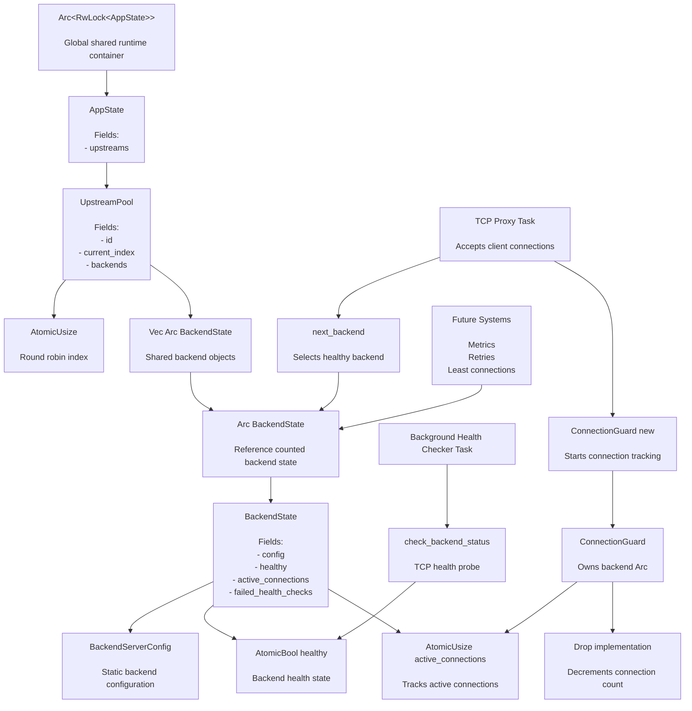

# Laminar

Laminar is a high-performance experimental load balancer written in Rust.

The project focuses on building modern load balancing infrastructure from first principles while emphasizing:

- correctness
- observability
- maintainability
- incremental architecture evolution

This repository is intentionally developed in stages, starting from a minimal working implementation and progressively evolving toward production-grade infrastructure.

---

# Current Features

- TCP proxying
- Config-driven upstream management
- Async runtime powered by Tokio
- Backend state management
- Health checking foundation
- Structured CI workflow
- Clippy and formatting enforcement

---

# Project Structure

```txt
src/
├── algorithms/
├── config/
├── proxy/
├── state/
└── common/

tests/
docs/
scripts/
```

---

# Requirements

- Rust stable
- Cargo

Optional tooling:

```bash
cargo install cargo-watch
cargo install cargo-audit
cargo install cargo-deny
```

# Initial Setup

After cloning the repository, run:

```bash
make setup
```

This configures:

- local git hooks
- executable development scripts
- automated pre-commit and pre-push checks

After setup:

- `git commit` automatically runs formatting and clippy fixes
- `git push` automatically runs verification checks

This setup only needs to be run once per repository clone.

---

# Running The Project

```bash
make run
```

Release build:

```bash
make release
```

---

# Development Workflow

Before pushing code:

```bash
make fix
make verify
```

This ensures:

- formatting passes
- clippy passes
- tests pass
- dependency checks pass
- license checks pass

CI will fail if these checks do not pass.

---

# Available Commands

```bash
make help
```

Common commands:

```bash
make run
make test
make fix
make verify
make ci
```

---

# Laminar Runtime Architecture Diagram



# Runtime Flow Summary

1. Client connects to Laminar TCP proxy.
2. Proxy task accesses shared AppState.
3. next_backend() selects a healthy backend.
4. Backend Arc is cloned and moved into ConnectionGuard.
5. ConnectionGuard increments active_connections.
6. TCP traffic is proxied between client and backend.
7. When connection ends, ConnectionGuard drops automatically.
8. active_connections is decremented safely.
9. Background health checker continuously updates backend health state.

---

# CI Policy

All pull requests must pass CI before merging.

CI currently validates:

- formatting
- clippy
- tests
- build integrity

The project intentionally keeps CI lightweight during early development stages.

---

# License

Licensed under :

- MIT license
